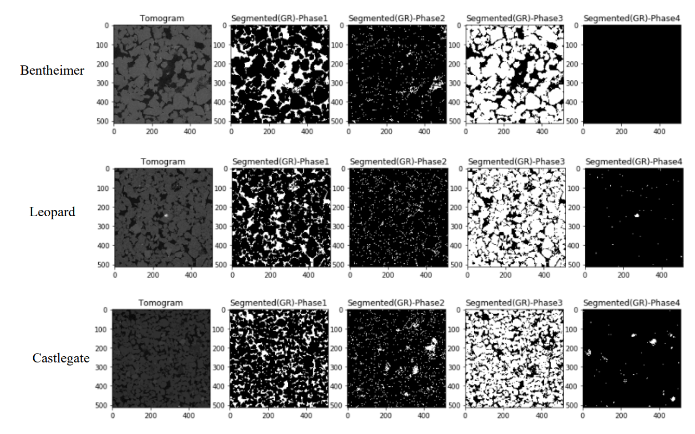
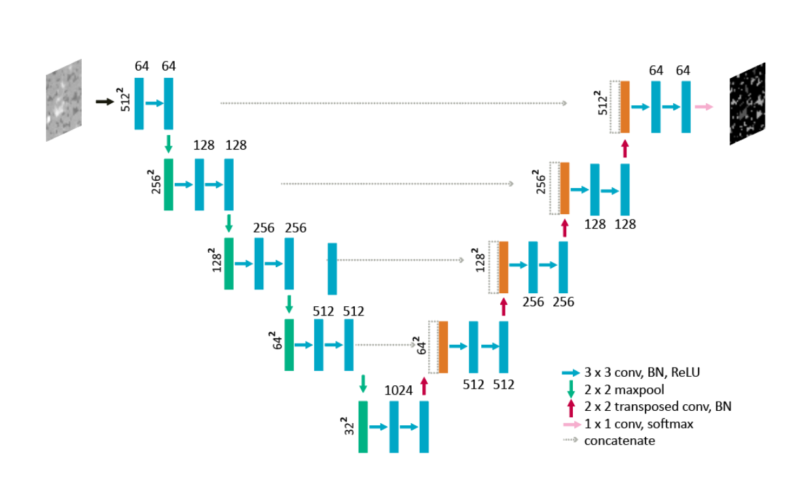
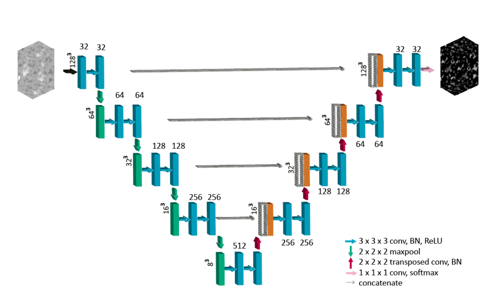
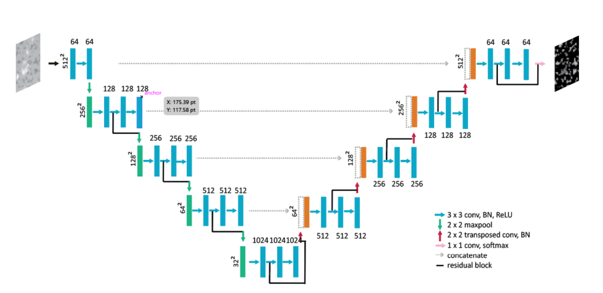
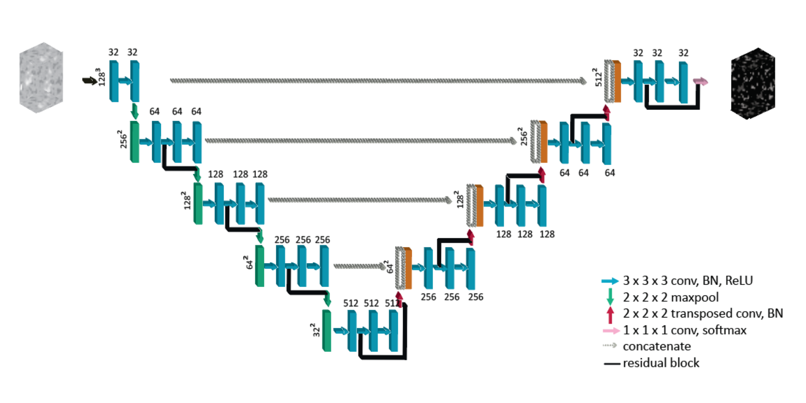

# Image segmentation in Digital Rock Physics

In this project, I have built and tested 2D and 3D UNet, U-ResNet, and ResUnet using Keras and 
Tensorflow implementation in Python and trained with datasets obtained from Professor 
Christoph Arns. Intersection over union (IOU) was used as a metric to see the performance of 
each model on each phase of the predicted image. For measuring the physical accuracy of the 
models, the Euler number for each phase was computed. The 2D UNet, U-ResNet, and ResUNet
are trained on 134 million pixels and 3D UNet, U-ResNet and ResUNet are trained on 37 million 
pixels. Due to parallel computing issues with the Tensorflow package, the image size to train on 
3D models was reduced. From multiple tests using different datasets, the models are working 
with about 99% accuracy on validation dataset with 2D while obtaining reasonable accuracy 
with 3D due to time and computing constraints.

Advisors: Masa Prodanovic & Christoph Arns

## Dataset and Workflow

## CNN Architectures

### 2D UNet

### 3D UNet

### 2D ResUNet

### 3D ResUNet

### 2D U-ResNet

### 3D U-ResNEt

### Paper link:
https://ahadmomin.github.io/files/Final%20Report-%20Ahad%20Momin.pdf